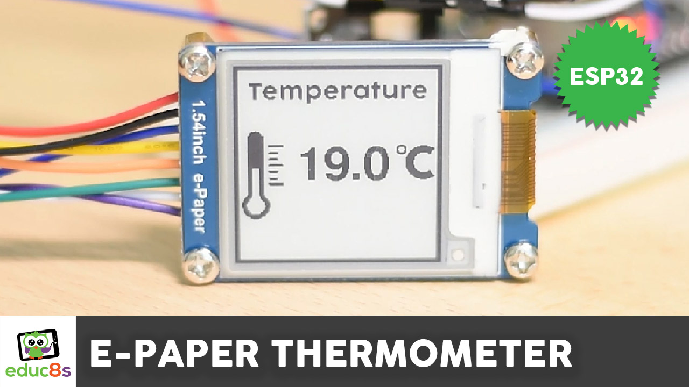
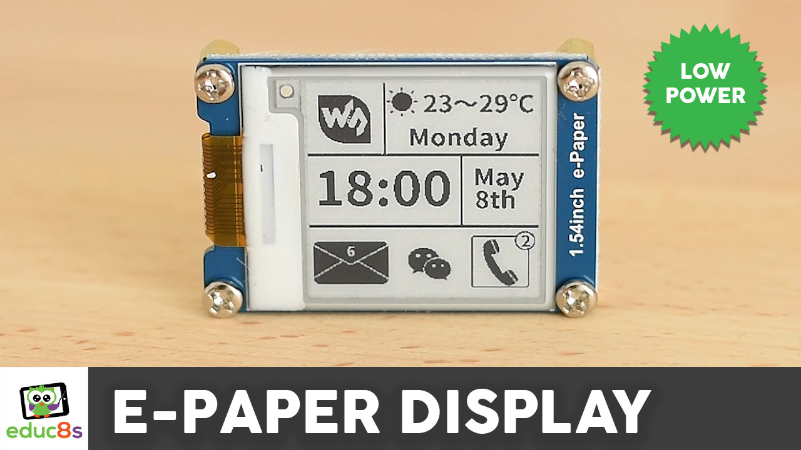
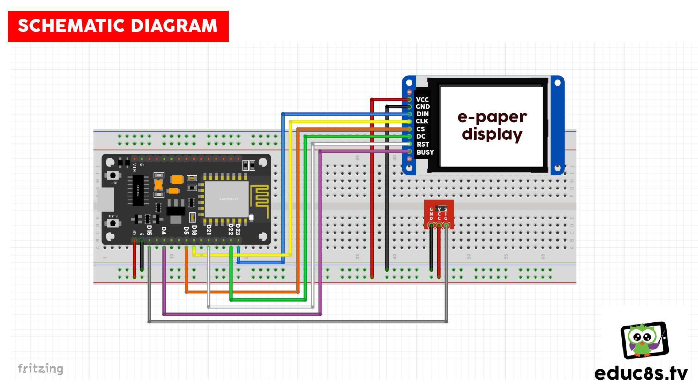

# ESP32-E-Paper-Thermometer-with-DS18B20-sensor
This is a simple ESP32 E-Paper Thermometer with DS18B20 sensor. 

  

🎥 [Watch the video on YouTube](https://www.youtube.com/watch?v=KKfFgdhtfzk)

# Parts used

🛒 ESP32 ▶ https://educ8s.tv/part/ESP32

🛒 E-Paper Display ▶ https://educ8s.tv/part/EPaper154

🛒 DS18B20 ▶ https://educ8s.tv/part/DS18B20

🛒 Breadboard ▶ https://educ8s.tv/part/SmallBreadboard

🛒 Wires ▶ https://educ8s.tv/part/Wires

💖 Full disclosure: All of the links above are affiliate links. I get a small percentage of each sale they generate. Thank you for your support!

# How to use the E-Paper display

The Seeeduino Xiao board comes with the Arduino bootloader pre-loaded when you buy it. If you want to program it using CircuitPython you have to load the CircuitPython bootloader to it. Watch the following video to find out how to do it.

  

🎥 [Watch the video on YouTube](https://www.youtube.com/watch?v=UBEhod2wxvE)

# Schematic Diagram

  

# Credits & Thanks

  - Kudos to [Adafruit Industries](https://github.com/adafruit) for being the creator of the display libraries without which this project would not exist.

